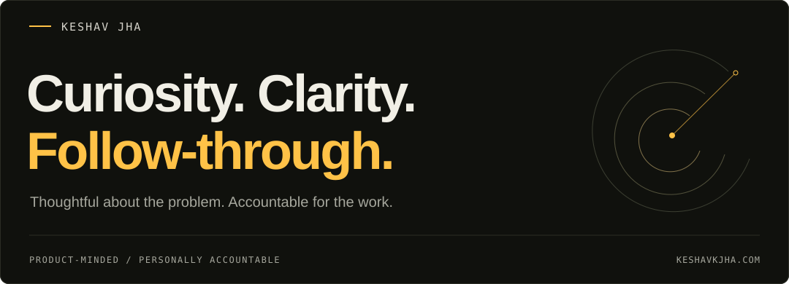

<a href="https://keshavkjha.com">
  <picture>
    <source media="(max-width: 600px)" srcset="./assets/profile-header-mobile.svg">
    
  </picture>
</a>

# नमस्ते, I'm Keshav.

I'm a software engineer based in **Pune, India**. Inquisitive by nature, spiritual at heart.

I'm drawn to the reason beneath a request, the small friction someone has learned to live with, and the moment a complicated thing finally makes sense.

Software gives that curiosity somewhere to go. I like moving between the human problem and the technical one—without losing sight of either.

### The questions I come back to

- *What actually matters here?*
- *Can this be simpler without losing something important?*
- *What haven't I understood yet?*

I want to stay a student, even as the work changes. Of technology, of people, and of my own assumptions.

  
A few coordinates

- **At the keyboard:** macOS, Neovim, Ghostty, Oh My Zsh.
- **Still exploring:** Rust, and whatever else raises a good question.
- **Always welcome:** A thoughtful conversation. It doesn't have to be about code.

---

This is a small introduction. The work, the decisions, and the longer story live in **[my portfolio →](https://keshavkjha.com)**.

[Email](mailto:hello@keshavkjha.com) &nbsp; / &nbsp; [LinkedIn](https://www.linkedin.com/in/mekkj98)
